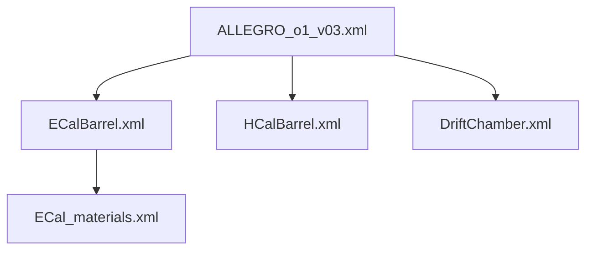
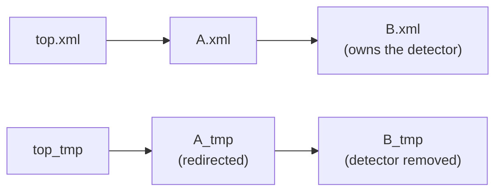

# Geometry patching

Geometry patching is the trick that lets k4Bench add or remove detectors
without ever touching the original XML. It lives in
[`k4bench.geometry.patcher`](../../reference/api/geometry/patcher.md) and
[`k4bench.geometry.index`](../../reference/api/geometry/index.md).

## Purpose

DD4hep geometries are split across many XML files linked by
`<include ref="..."/>` tags, and they usually live on a **read-only CVMFS
mount**. To benchmark "the geometry minus detector X" you need a modified
geometry — but you cannot edit the originals, and naïvely copying just one file
breaks the include graph. The patcher solves this by producing a self-consistent
set of *temporary* XML files with the requested detectors removed, and handing
`ddsim` a patched top-level file that transparently points at them.

## How it works

### Step 1 — Index the geometry once

[`GeometryIndex`](../../reference/api/geometry/index.md) walks `<include
ref="...">` recursively from the top-level XML. In one traversal it records
reachable files, forward and reverse include edges, detector declarations,
plugin argument values, and every DD4hep filesystem reference.



Discovery uses a lenient index so listing detectors can still return useful
results from a partly broken tree. Patching uses a strict index and refuses to
write a geometry if any locally resolvable reachable file cannot be read.
Refs containing `$` (for example `${DD4hepINSTALL}/...`) remain unresolved on
purpose because ddsim applies its own search path.

### Step 2 — Apply one removal transform

All modes reduce to a set of detector names to remove. The same engine removes
every declaration of those names. A single-removal run passes one name;
keep-only passes the complement of the requested keep set.

### Step 3 — Remove orphaned plugins

DD4hep `<plugin>` elements often reference a detector by name in an
`<argument value="...">`. When a detector is removed, its plugins would dangle,
so the patcher deletes any `<plugin>` whose argument values name a removed
detector.

The sweep is over **every** reachable file, against the **complete** set of
removed names — a plugin and the detector it names need not share a file. A file
that loses only a plugin this way gets a patched copy like any other.

!!! warning "Plugin removal is heuristic"
    This relies on the DD4hep convention that detector identity is encoded in
    argument `value` attributes. Plugins that reference detectors *differently*
    (other attributes, child elements) are **not** caught and may survive,
    potentially causing a ddsim error. If a sweep run fails only for one
    detector with a plugin-related message, this is the first thing to check.

### Step 4 — Find and allocate the replacement graph

The index's reverse edges identify every ancestor of a modified file with a
plain breadth-first traversal. Each replacement is allocated a deterministic
`NNN_<original-name>` path inside one private patch directory before anything
is written, so diamonds and modified-parent/modified-child shapes are safe.

### Step 5 — Rewrite filesystem references

Because the patched files land in a temp directory (not next to the originals),
all *relative* file references must become absolute or ddsim can't find them.
The patcher rewrites `ref="..."` to absolute paths — but **only** on
`<include>`, `<gdmlFile>`, and `<file>` elements, the three DD4hep element types
whose `ref` is guaranteed to be a filesystem path. Other elements (e.g.
`<detector ref="...">`, where `ref` is a logical name) are left untouched. Refs
with `$` or already-absolute paths are skipped.

Generated replacements are retargeted in the same walk that absolutizes
remaining relative refs.

### Step 6 — Validate before ddsim

This is the subtle part, and it applies to **both** modes. A patched file is only
reached by ddsim if **every** file on the path from the top level down to it
references the patched copy.



Rewriting the top level's own includes covers `top → owner` and nothing deeper:
for `top → A → B` with only `B` patched, no include in `top` resolves to `B`, so
`A` needs a redirected copy too even though nothing was removed from it. Skipping
that does not fail loudly — the patched copy is simply never referenced, ddsim
loads the original subtree, and the run silently keeps the detector it was
supposed to drop.

Before returning, the patcher reindexes the generated tree strictly. It rejects
missing filesystem targets, removed detectors that remain, unexpected detector
names, generated subfiles that are unreachable, and original files that should
have been replaced but remain reachable. Detectors that disappear because they
were reachable only inside a removed detector are recorded as collateral
removals.

## Inputs

- The original top-level compact XML path.
- A detector name (single removal) or a set of names to keep.

## Outputs

Each patch owns one system-temp directory prefixed
**`_k4bench_patch_`**. It contains the generated top level and deterministic
`NNN_<original-name>` replacement files. Removing the directory cleans up the
whole patch atomically from the caller's perspective.

## The context managers (use these)

You almost never call the builders directly. Two context managers guarantee
cleanup even on exception:

```python
from pathlib import Path
from k4bench.geometry.patcher import patched_geometry, patched_geometry_keep_only

# Remove a single detector
with patched_geometry(Path("ALLEGRO_o1_v03.xml"), "ECalBarrel") as tmp_xml:
    ...  # tmp_xml is the patched top-level; run ddsim against it

# Keep only a subset
with patched_geometry_keep_only(Path("ALLEGRO_o1_v03.xml"), {"Vertex", "DriftChamber"}) as tmp_xml:
    ...
```

On exit (normal or exceptional) the complete patch directory is removed.

## Failure modes

| Symptom | Cause | What to do |
| --- | --- | --- |
| `DetectorNotFoundError` | the name isn't a `<detector name>` in any reachable file | check spelling; list names with `get_detector_names` |
| `GeometryParseError` | a locally reachable file is missing or malformed | repair the include tree before patching |
| `PatchValidationError` | the generated include graph, refs, or detector set is inconsistent | do not run ddsim; report the patcher failure |
| `Could not absolutize ref '...'` warning | a relative ref points at a missing file | verify the geometry is complete |
| ddsim fails only for one swept detector | an orphaned plugin survived removal | inspect that detector's `<plugin>` definitions (see the warning above) |

## See also

- [Sweep modes](sweep-modes.md) — which patching path each mode uses.
- [`geometry.scanner`](../../reference/api/geometry/scanner.md) /
  [`geometry.patcher`](../../reference/api/geometry/patcher.md) — full API.
